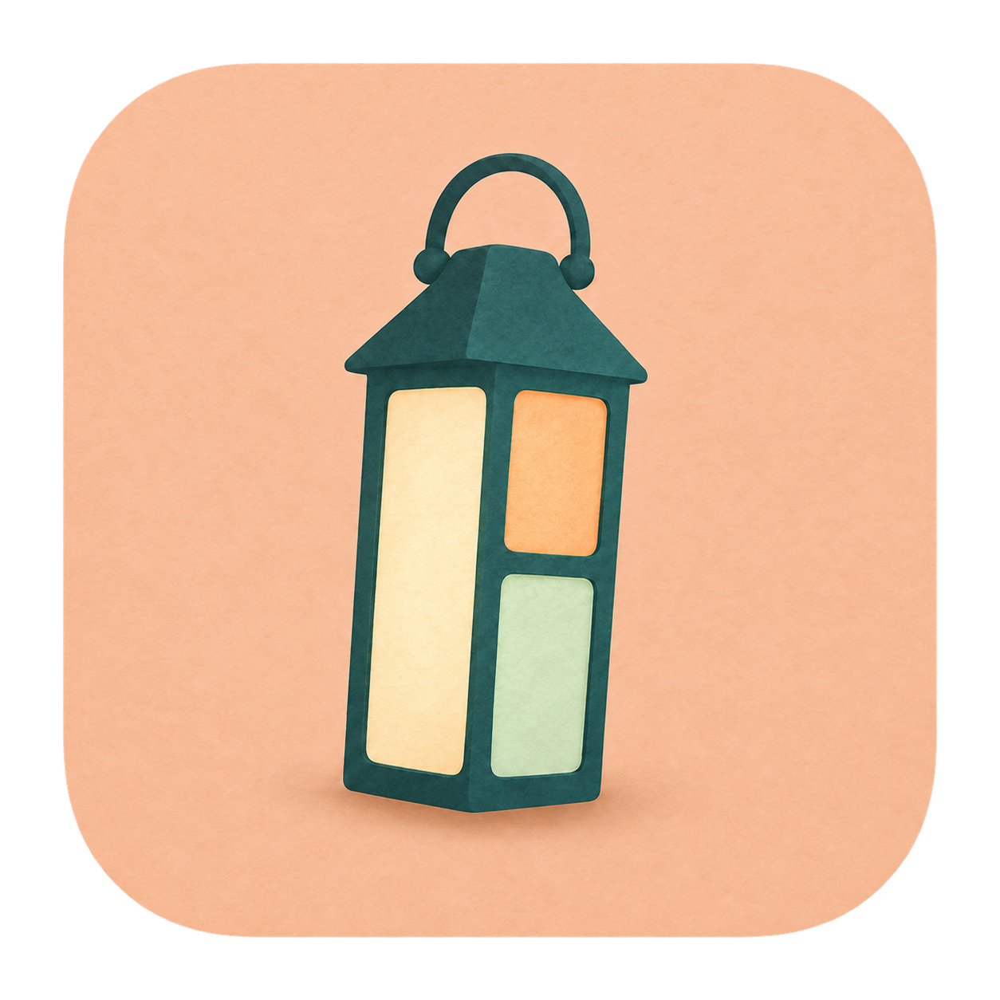

# bmux



### tmux for your browser.

Split panes. Persistent sessions. Isolated profiles. bmux is a Chromium browser for people who live at the keyboard, with a CLI for background browser automation.

[Website](https://bmux.cc) · [Download](https://github.com/tonisives/bmux/releases/latest) · [Get started](#get-started) · [Keyboard shortcuts](docs/keyboard.md) · [Automation guide](docs/agent.md)

[](https://bmux.cc/#split-panes)

## Features

- **Split your workspace** — Keep docs, dashboards, and apps side by side. Save and restore named layouts.
- **Persistent sessions** — Detach a client while its pages keep running. Reattach to the same live pages and form state.
- **Isolated profiles** — Separate logins, cookies, storage, and permissions. Use different profiles in the same layout.
- **Keyboard control** — A tmux-style prefix, native click hints, command prompt, and desktop shortcuts. See [Keyboard](docs/keyboard.md).
- **Quiet interface** — Native Chromium page content above one status bar. Controls appear when needed.
- **Background automation** — Navigate, inspect, click, type, evaluate JavaScript, and take screenshots through `bmux` without stealing focus.
- **Find pages again** — Search profile-scoped browsing history, save pages into bookmark folders stored in `~/.config/bmux/bookmarks.yaml`, or import Brave profile names and bookmarks. See [Bookmarks](docs/bookmarks.md) and [Import from Brave](docs/brave.md).
- **Live configuration** — Customize keyboard bindings in YAML without restarting the app.
- **Browser tools** — Ad/tracker blocking, Dark Reader, encrypted saved forms, Bitwarden browser extension, and local userscripts. See [Browser tools](docs/browser-tools.md).
- **Script plugins** — Add local actions and page hooks in any language, with DOM access and native prompts. See [Plugin authoring](docs/plugins.md).

bmux is an early preview, free under the [GNU GPL version 3](LICENSE). The [original MIT notice](LICENSE-MIT) is retained for code previously distributed under MIT. Release builds are unsigned. It does not require tmux.

### Switch sessions

Keep a workspace for each project.

[](https://bmux.cc/#switch-sessions)

## Made for agents

Give your agents a browser that stays out of your way. With bmux, they can navigate real Chromium pages, inspect the DOM, run JavaScript, click, type, and capture screenshots through a CLI with JSON output and explicit tab IDs. Isolated profiles keep logins separate, while bot profiles keep background pages running. Split panes and saved layouts make it easy to follow their work. Detach and reconnect to live sessions whenever you need to, without background commands stealing your focus.

[](https://bmux.cc/#agents)

## Get started

Install the latest release with Homebrew:

```sh
brew install --cask tonisives/tap/bmux
```

You can also download Apple Silicon and Intel DMGs from the [latest GitHub release](https://github.com/tonisives/bmux/releases/latest).

Release builds are currently unsigned, so macOS may require you to confirm the first launch in System Settings. The bundled `bmux` CLI requires Node.js 22.12+ (Node 24 recommended).

To run from source, install Node.js 22.12+ and pnpm 11:

```sh
git clone https://github.com/tonisives/bmux.git
cd bmux
pnpm install
pnpm dev
```

See [Packaging](docs/packaging.md) for build artifacts and platform notes. Add this checkout's `bin` directory to your PATH to use `bmux` from any terminal, or run `./bin/bmux` directly.

Try Control+B, then `%` to split a pane, `s` to switch sessions, or `?` for help. See [Keyboard](docs/keyboard.md) for more shortcuts.

## Model

| Term | Meaning |
| --- | --- |
| Profile | Persistent cookies, site storage, cache, and permission choices |
| Session | Named collection of internal windows |
| Window | Named layout of browser panes |
| Pane | One browser page with a fixed profile |
| Client | A desktop window attached to a session |

Clients choose their current internal window independently. Visible clients keep their live browser views when the app loses focus. If multiple clients display the same page, focusing one transfers that page to it; the others show captured previews. Clients displaying different pages can render them simultaneously. Moving a view between clients preserves the actual page, form state, and JavaScript state. Detaching the last client leaves the server and pages running. **Quit** stops the browser.

Panes can mix profiles within a layout. Panes with the same profile share logins; different profiles have separate site storage. A pane's profile is fixed for its lifetime. Create a new pane to use another profile.

Floating panes stay inside their internal bmux window, above its split panes. Right-click a link and choose **Open Link in Floating Pane**, or right-click a pane's page or address bar and choose **Float Pane**. JavaScript-driven X posts resolve to their detail pages too. Drag the floating header to move it and drag an edge or corner to resize it. Selecting a float brings it forward. Positions, sizes, and stacking survive a restart.

Right-click a floating pane's header to **Return to Split** or **Move to Window**. Returning restores its former split position when available. Floating and docking keep the same pane, profile, tabs, and live pages. From the command prompt, use `new-pane`, `break-pane -W`, or `join-pane`. The CLI accepts explicit targets, for example `bmux move-pane -t PANE --window WINDOW`; `-t` remains the source pane in bmux. Use `move-pane -t PANE --x 100 --y 80` to position a float and `resize-pane -t PANE --width 640 --height 480` to resize it. Coordinates are pixels within the workspace, excluding the status bar.

## Development

Requires Node.js 22.12+ (Node 24 recommended) and pnpm 11. See [Platform notes](docs/platforms.md) for host-specific requirements.

```sh
pnpm install
pnpm dev
```

The renderer reloads during development. Browser content runs sandboxed, without Node integration or a privileged preload. The application interface has a narrow IPC bridge.

See the [roadmap](docs/todo.md) for the development backlog and recently completed work.

See [Local verification](docs/verification.md) for checks, test artifacts, and GUI test setup.

The product website is at [bmux.cc](https://bmux.cc). Its source and deployment are maintained separately from this browser repository.

Build and launch locally:

```sh
pnpm build
pnpm start
```

Use the repository CLI without a global installation:

```sh
./bin/bmux.mjs --help
./bin/bmux.mjs status
./bin/bmux.mjs attach-session -t main
```

Optionally add this checkout's `bin` directory to PATH; the `bmux` wrapper invokes the CLI. Browser commands silently start the server when needed. `attach-session` and `activate-client` intentionally show a client; navigation and screenshot commands do not. Activating an already-focused client preserves its focused page, text caret, or prompt.

The previous `brmux` command remains as an alias for existing scripts.

## Basic workflow

```sh
bmux profile create work
bmux new-session -s project-a --profile work
bmux attach-session -t project-a
bmux list-windows -t project-a
bmux list-panes -t <window-id>
bmux split-window -t <pane-id> -h --profile bot
bmux new-window -t project-a -n monitoring
bmux select-window -c <client-id> -t <window-id>
bmux save-layout -t <window-id> -n development
bmux restore-layout -t <window-id> -n development --confirm
```

CLI output is JSON: `{ "ok": true, "result": ... }`. Errors use `ok: false`, an error message, and a nonzero exit code. Browser actions require an explicit tab ID; IDs are returned by `tab list` and creation commands. A tab ID stays stable across view transfers and session restarts. A page reload or process crash can reset JavaScript state even though the application tab ID remains the same.

The `default` profile throttles inactive pages. The `bot` profile keeps background pages running. Additional bot profiles can be created using `profile create NAME --background`. A bot profile is a browser storage partition with a background-execution policy, not an OS user account or an authorization boundary against the local CLI.

## Guides

- [Keyboard shortcuts and configuration](docs/keyboard.md)
- [Bookmarks and YAML storage](docs/bookmarks.md)
- [Import profiles and bookmarks from Brave](docs/brave.md)
- [Downloads](docs/downloads.md)
- [Browser tools](docs/browser-tools.md)
- [Plugin authoring](docs/plugins.md)
- [Browser automation](docs/agent.md)
- [Packaging](docs/packaging.md)
- [Platform notes](docs/platforms.md)
- [Local verification](docs/verification.md)

## Data and permissions

Application state and profile partitions use the platform's application-data directory. Set `BMUX_DATA_DIR` to an absolute path to run an isolated instance. Tests use disposable directories and never use your real profiles.

Bookmarks live in `~/.config/bmux/bookmarks.yaml`, alongside keyboard settings. See [Bookmarks](docs/bookmarks.md) for the format and migration details.

Layouts, profiles, open URLs, zoom, and client selections are persisted. Relaunching reopens pages; it does not reconstruct arbitrary JavaScript memory or unsaved forms. Named layout restoration replaces a window's pages and requires confirmation.

Permission requests appear in the focused window without taking focus from the page. Decisions are saved by profile, origin, and permission. Manage pending requests in Activity or with `permission list` and `permission respond`.

The control socket is accessible only to the current OS user. No network debugger port is exposed by default. See [Browser automation](docs/agent.md) for CLI usage.

## Current boundaries

Local script plugins are available through the `plugins` command and `bmux plugin` CLI. They are explicitly enabled in YAML and run with your OS privileges. The example Bitwarden desktop plugin is experimental; see its [verification status](examples/plugins/experimental.bitwarden/README.md).

Experimental Chrome extension support, including Bitwarden installation, is described in [Browser extensions](docs/extensions.md). External Chrome/Brave embedding and cloud synchronization are not supported. Website recoloring, ad blocking, and stored fills are described in [Browser tools](docs/browser-tools.md). JavaScript alert/confirm/prompt dialogs are disabled so pages cannot steal focus; permission requests use bmux's Activity flow. Full-page screenshots capture the currently rendered document; lazy content may require scrolling first. Pages exceeding 80 megapixels require a viewport capture or an explicit CDP clip.

Do not expect Electron to provide every Chrome feature: DRM media, platform authentication integrations, and sites that reject embedded browsers may require additional work.

To make bmux your default browser, open Settings with `Cmd+,` in the installed
app and choose **Make bmux the default browser**. Confirm the macOS prompt if
shown. You can also select bmux in System Settings > Desktop & Dock > Default
web browser. Links from other apps open in a new internal window in the active bmux session.
