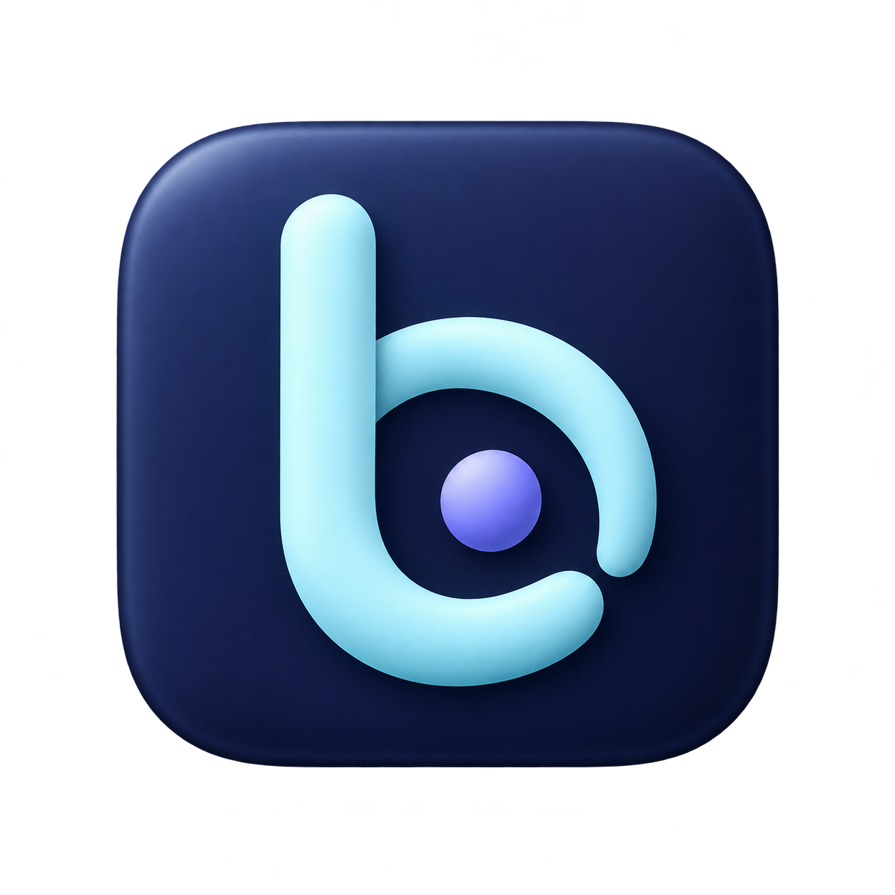

# bmux icon concepts

The [warm follow-up round](warm-round/README.md) explores five more humane, pleasant directions: paper, plants, nature and everyday objects.

The [slim follow-up round](slim-round/README.md) contains five lighter alternatives for review, with numbered previews and generation prompts.

**Selected: Little lantern.** Used for the macOS app, website, and favicon. The [production artwork](../app-icon.png) has a transparent outer margin. Run `pnpm icons` on macOS to regenerate the packaged sizes. The [warm round](warm-round/README.md) records the original concept and prompt.

Five original raster app-icon directions generated with the built-in image generation tool. Split planet was the first selected app icon; these directions remain here for reference. All retain an orbital or scientific motif inspired by the user's preference for Electron's existing icon.

## Orbital panes

Prompt:

Create one unique macOS app icon concept for bmux, a Chromium browser with tmux-style split panes. Concept 1: ORBITAL PANES. Use a dark navy circular disc, pale icy cyan thick rounded linework, and one crisp central three-pane browser window symbol: tall pane on the left, two short stacked panes on the right. One elegant elliptical orbital arc travels diagonally around the pane symbol with two small luminous solid satellite dots. Express browser multiplexing and orbital motion. Inspired only by the simplicity and scientific personality of Electron's icon; invent a distinct composition, not the Electron atom symbol. Extremely clean flat vector-like raster design, restrained depth, strong silhouette, legible at 32 pixels. Perfectly centered, generous transparent outer margin on a 1024x1024 transparent canvas. No words, no letters, no numerals, no watermark, no desktop mockup. Single finished icon only.

## Split planet

Prompt:

Create one unique macOS app icon concept for bmux, a Chromium browser with persistent sessions and split panes. Concept 2: SPLIT PLANET. A single pale lime planet composed of three bold softly rectangular browser panes fitted together with clear dark gutters: one tall left pane and two stacked right panes. A slender incomplete Saturn-like orbital ring encircles this abstract spherical pane grid diagonally, with a small orbiting dot at the upper right. Deep almost-black olive circular disc behind the symbol. Colors #111310 and #c4f580 with a tiny pale cream highlight. Distinctive, minimal, sophisticated software icon inspired by orbital physics and a window manager. Do not reproduce Electron's atom. Crisp flat geometry with very subtle premium material shading; excellent at small sizes. Center one icon on a 1024x1024 transparent canvas with 10 percent transparent margin. No text, no lettering, no numerals, no watermark, no mockup.

## Orbit b

Prompt:

Create one unique macOS app icon concept for bmux browser. Concept 3: ORBIT B. Invent a distinctive abstract lowercase b monogram from one continuous thick pale cyan orbital ribbon. The straight stem suggests a vertical pane divider and the curved bowl is an incomplete orbital loop surrounding one smaller violet satellite dot. The monogram should read as both lowercase b and a portal into a browser workspace, extremely simple and sculptural. Dark midnight indigo rounded-square macOS icon tile with smoothly curved corners; subtle bevel and gentle directional light, restrained three-dimensional soft enamel appearance, no glow. Cyan and soft periwinkle only. Inspired by Electron's calm scientific aesthetic but a completely different silhouette, no atom. One isolated icon centered on 1024x1024 transparent canvas with comfortable margin. No wordmark or other text, no number, no watermark, no background scene.

## Linked panes

Prompt:

Create one unique macOS app icon concept for bmux browser. Concept 4: LINKED PANES. Two elegant interlocking rounded rectangular orbital loops, one aqua and one soft mint, arranged horizontally like a subtle infinity symbol but visibly formed from two browser windows with shared central divider. A single small white satellite dot at the upper right suggests a session in motion. Balanced asymmetric composition, bold simple lines, plenty of negative space. Deep blue-gray circular disc background. Clean precise geometric raster icon in the understated scientific spirit of Electron's logo, but no atom and no trio of ellipses. Crisp edge definition, flat graphic design with a whisper of depth, highly recognizable at dock and menu-bar sizes. One centered finished icon on transparent 1024x1024 canvas with generous margin. No text, no numerals, no watermark, no mockup.

## Command core

Prompt:

Create one unique macOS app icon concept for bmux, a keyboard-first Chromium browser with tmux sessions. Concept 5: COMMAND CORE. An elegant central terminal-style angle prompt and short cursor block, built from thick softly rounded icy blue geometry, floats inside a broken circular orbital ring. Two small rounded browser-pane tiles orbit at opposite ends of the broken ring, communicating one command controlling multiple browser views. Dark graphite softly rounded macOS square tile, pale ice-blue main symbol, small electric teal accents on the two panes. Strong central silhouette, bold and minimal, refined subtle 3D inset or embossed appearance with soft top-left light. Electron-inspired scientific calm with original window-and-command symbolism; do not draw an atom. Single app icon centered on transparent 1024x1024 canvas with 10 percent margin. No readable text, no app name, no numbers, no watermark, no desktop mockup.
