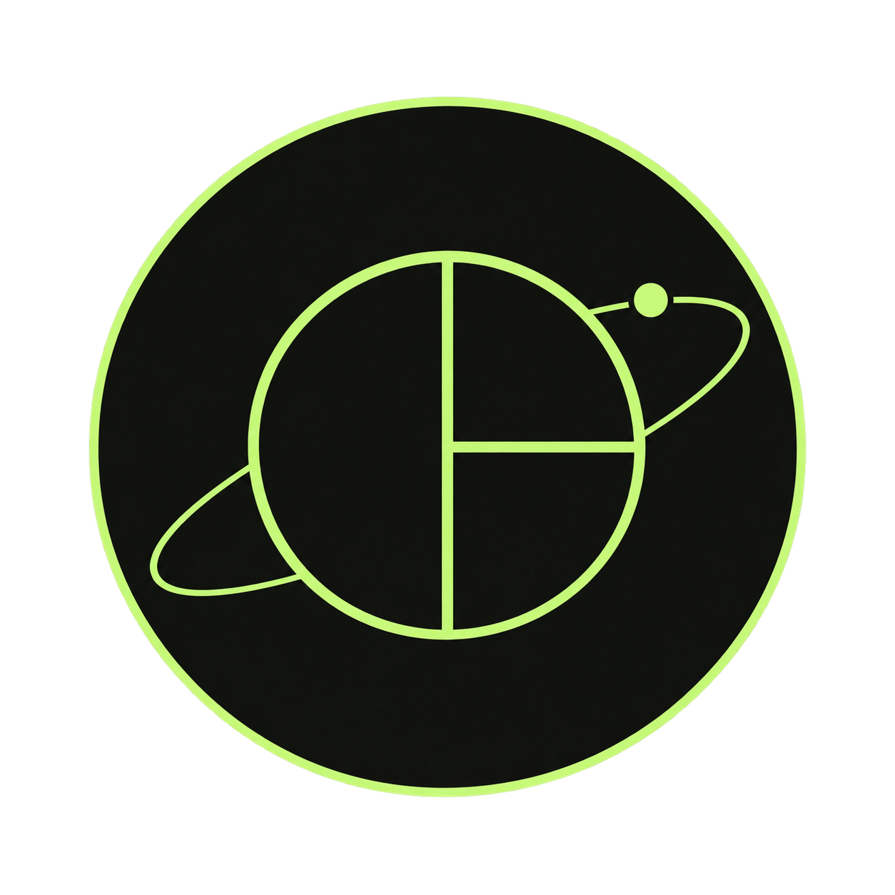
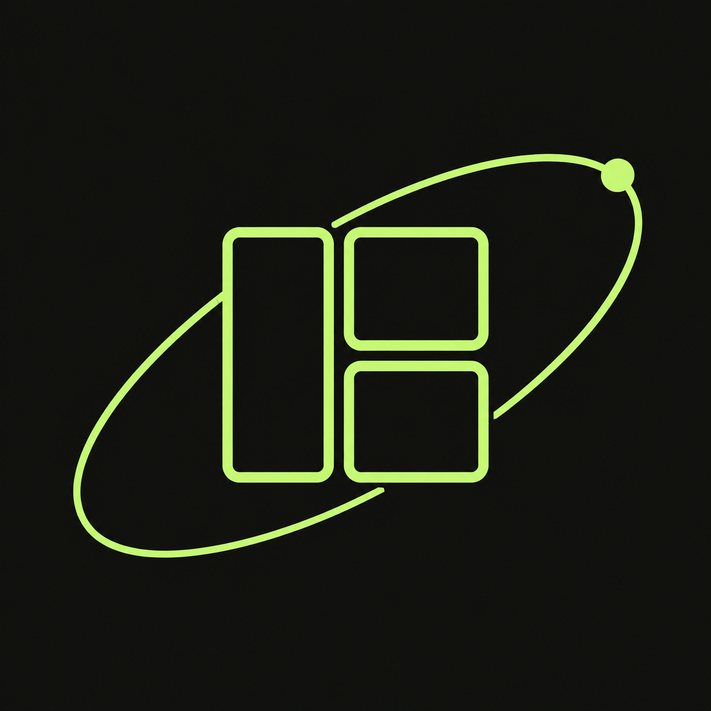
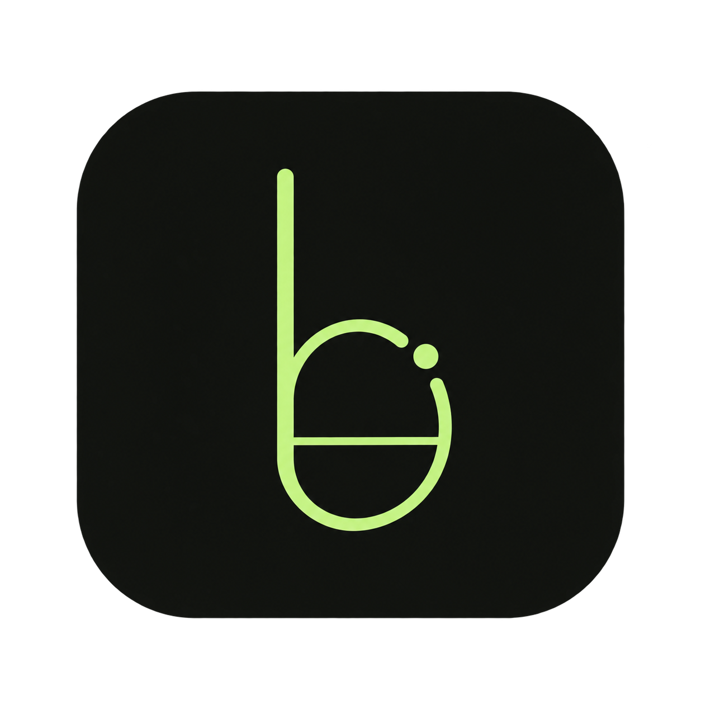
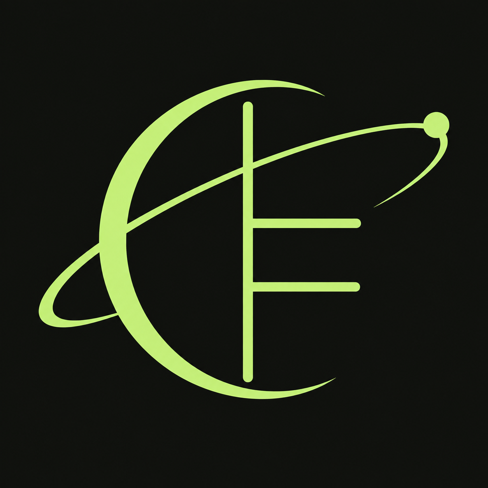
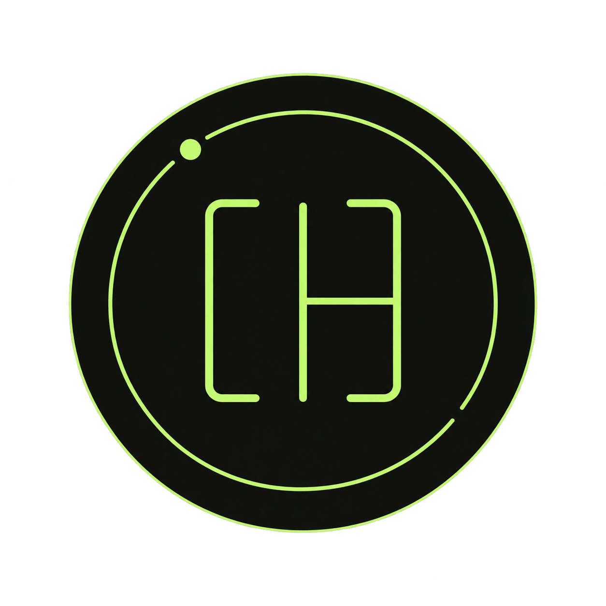

# Slim bmux icon concepts

Five alternatives generated with the built-in image generation tool. The brief was to make the selected Split planet icon feel slimmer, using lighter geometry and more open space while keeping its lime palette and orbital theme.

These earlier candidates remain for reference. Little lantern from the [warm round](../warm-round/README.md) is now selected for the app and website. Floating panes and Split crescent use opaque dark backgrounds to keep their preview edges clean; the other three retain transparent outer margins.

## 1. Outline planet

Prompt:

Use case: logo-brand. Asset type: one new macOS app icon concept for bmux, a Chromium browser with tmux-style split panes and persistent sessions. This is a new design exploration. The current icon is a lime split planet with three thick, bulging filled panes and a Saturn ring; the user dislikes how fat it looks. Make this alternative unmistakably slimmer, airy and precise, with abundant negative space. Preserve the scientific orbital personality and pale lime #c4f580 on near-black olive #111310. Use clean flat vector-like raster geometry, restrained smooth edges and a strong small-size silhouette. No puffiness, inflated surfaces, thick ribbons, bevels, glossy 3D, chrome, bloom, texture, UI control dots, wordmark, lettering, numerals, watermark, mockup or scene. Single icon only, square 1024x1024 canvas, centered with 12 percent generous outer margin. Actual transparent background outside the icon silhouette. Concept: OUTLINE PLANET. An elegant circular dark olive badge. Inside, a thin pale-lime circular outline contains one slender vertical divider and one slender horizontal divider on the right, suggesting one tall left browser pane and two stacked right browser panes. All three pane interiors remain entirely dark and open, no solid lime panels. A delicate diagonal elliptical Saturn orbit passes around the pane circle, selectively occluded to stay very clear, with one tiny lime satellite at upper right. Main outline and dividers approximately 14 pixels wide on 1024 canvas, orbit approximately 10 pixels. Flat matte silhouette, carefully balanced line weights. Central pane circle no more than 45 percent canvas width; badge 72 percent canvas width.

## 2. Floating panes

Prompt:

Use case: logo-brand. Asset type: one new macOS app icon concept for bmux, a Chromium browser with tmux-style split panes and persistent sessions. This is a new design exploration. The current icon is a lime split planet with three thick, bulging filled panes and a Saturn ring; the user dislikes how fat it looks. Make this alternative unmistakably slimmer, airy and precise, with abundant negative space. Preserve the scientific orbital personality and pale lime #c4f580 on near-black olive #111310. Use clean flat vector-like raster geometry, restrained smooth edges and a strong small-size silhouette. No puffiness, inflated surfaces, thick ribbons, bevels, glossy 3D, chrome, bloom, texture, UI control dots, wordmark, lettering, numerals, watermark, mockup or scene. Single icon only, square 1024x1024 canvas, centered with 12 percent generous outer margin. Actual transparent background outside the icon silhouette. Concept: FLOATING PANES. An unbacked freestanding icon with real transparent negative space, no background tile or disc. Three small slim lime outline rounded rectangles form an airy browser workspace: one tall pane left, two stacked panes right, each hollow with no fill and almost square corners. The compact central pane cluster is about 38 percent canvas width. A single fine asymmetric elliptical orbit arcs around the cluster diagonally upward, terminating at one tiny filled satellite; overall mark about 72 percent canvas width. Outline frames approximately 16 pixels and orbit 11 pixels at 1024 resolution, elegant and light yet readable. Lots of space between lines. Clear intentional original geometry.

Cleanup edit prompt:

Use case: precise-object-edit. Input image is the exact bmux icon concept to clean up. Preserve this icon's composition, proportions, positions, slim line weight, orbit and satellite, and pale lime #c4f580 color. Change only edge quality and backdrop: redraw every existing stroke as a perfectly smooth, clean, precise antialiased geometric edge; remove ALL yellow fringes, edge debris, scattered speckles and ragged pixels. Put the whole mark on a completely uniform opaque near-black olive #111310 square canvas, including all empty interiors and all the outer margin. This is an opaque design review preview: absolutely no transparency, no alpha cutout, no checkerboard, no gradient, no shadow, no new tile, no border. Keep the original slim mark geometry exactly and centered. Do not thicken shapes, add ornaments, glow, texture, text, logos or watermarks. Square image.

## 3. Orbit stem

Prompt:

Use case: logo-brand. Asset type: one new macOS app icon concept for bmux, a Chromium browser with tmux-style split panes and persistent sessions. This is a new design exploration. The current icon is a lime split planet with three thick, bulging filled panes and a Saturn ring; the user dislikes how fat it looks. Make this alternative unmistakably slimmer, airy and precise, with abundant negative space. Preserve the scientific orbital personality and pale lime #c4f580 on near-black olive #111310. Use clean flat vector-like raster geometry, restrained smooth edges and a strong small-size silhouette. No puffiness, inflated surfaces, thick ribbons, bevels, glossy 3D, chrome, bloom, texture, UI control dots, wordmark, lettering, numerals, watermark, mockup or scene. Single icon only, square 1024x1024 canvas, centered with 12 percent generous outer margin. Actual transparent background outside the icon silhouette. Concept: ORBIT STEM. A refined narrow lowercase-b-inspired abstract monogram formed from a slim straight vertical pale-lime stem and one clean elliptical bowl, open at the upper right with a tiny detached satellite dot. The stem also suggests a pane divider; add just one fine horizontal subdivision within the lower oval so it subtly reads as two browser panes. Tall slender proportion, central monogram height 54 percent canvas and width 30 percent. Stroke 17 pixels on 1024 canvas, smooth but not bulbous. A flat near-black olive rounded square behind it, 73 percent canvas width with restrained macOS corner radius, no depth or bevel. An abstract symbol only, no typeset text.

## 4. Split crescent

Prompt:

Use case: logo-brand. Asset type: one new macOS app icon concept for bmux, a Chromium browser with tmux-style split panes and persistent sessions. This is a new design exploration. The current icon is a lime split planet with three thick, bulging filled panes and a Saturn ring; the user dislikes how fat it looks. Make this alternative unmistakably slimmer, airy and precise, with abundant negative space. Preserve the scientific orbital personality and pale lime #c4f580 on near-black olive #111310. Use clean flat vector-like raster geometry, restrained smooth edges and a strong small-size silhouette. No puffiness, inflated surfaces, thick ribbons, bevels, glossy 3D, chrome, bloom, texture, UI control dots, wordmark, lettering, numerals, watermark, mockup or scene. Single icon only, square 1024x1024 canvas, centered with 12 percent generous outer margin. Actual transparent background outside the icon silhouette. Concept: SPLIT CRESCENT. A freestanding orbital mark with no solid disc or background tile, true transparent negative space. A slim elegant lime crescent wraps around three fine straight segments that suggest a browser split layout: one vertical spine and two short rightward crossbars, forming airy open pane brackets. The crescent is a narrow tapering curved stroke, never a fat moon or filled planet. One long, delicate oblique orbital arc sweeps behind the pane motif and has a tiny satellite at its far upper-right tip. Refined asymmetric balance and visibly lighter than a circular planet. Overall mark 72 percent canvas wide, open central area, mostly 12 to 18 pixel strokes at 1024. Flat lime only.

Cleanup edit prompt:

Use case: precise-object-edit. Input image is the exact bmux icon concept to clean up. Preserve this icon's composition, proportions, positions, slim line weight, orbit and satellite, and pale lime #c4f580 color. Change only edge quality and backdrop: redraw every existing stroke as a perfectly smooth, clean, precise antialiased geometric edge; remove ALL yellow fringes, edge debris, scattered speckles and ragged pixels. Put the whole mark on a completely uniform opaque near-black olive #111310 square canvas, including all empty interiors and all the outer margin. This is an opaque design review preview: absolutely no transparency, no alpha cutout, no checkerboard, no gradient, no shadow, no new tile, no border. Keep the original slim mark geometry exactly and centered. Do not thicken shapes, add ornaments, glow, texture, text, logos or watermarks. Square image.

## 5. Orbital brackets

Prompt:

Use case: logo-brand. Asset type: one new macOS app icon concept for bmux, a Chromium browser with tmux-style split panes and persistent sessions. This is a new design exploration. The current icon is a lime split planet with three thick, bulging filled panes and a Saturn ring; the user dislikes how fat it looks. Make this alternative unmistakably slimmer, airy and precise, with abundant negative space. Preserve the scientific orbital personality and pale lime #c4f580 on near-black olive #111310. Use clean flat vector-like raster geometry, restrained smooth edges and a strong small-size silhouette. No puffiness, inflated surfaces, thick ribbons, bevels, glossy 3D, chrome, bloom, texture, UI control dots, wordmark, lettering, numerals, watermark, mockup or scene. Single icon only, square 1024x1024 canvas, centered with 12 percent generous outer margin. Actual transparent background outside the icon silhouette. Concept: ORBITAL BRACKETS. An ultra-minimal dark olive circular badge with a small, light geometric glyph: two tall slender opposing square browser-frame brackets with softened corners, a fine central vertical divider and one short horizontal division on its right. This should evoke a three-pane tiling window manager, with intentional gaps at corners and all interiors empty dark space. Central glyph about 35 percent canvas wide and 42 percent high, stroke approximately 14 pixels at 1024. A single hairline circular orbit interrupted twice surrounds the glyph with plenty of breathing room; one tiny lime satellite on the upper left, no second orbit. Badge 73 percent canvas wide. Precise calm two-dimensional design, very spare, no buttons or decorations.
