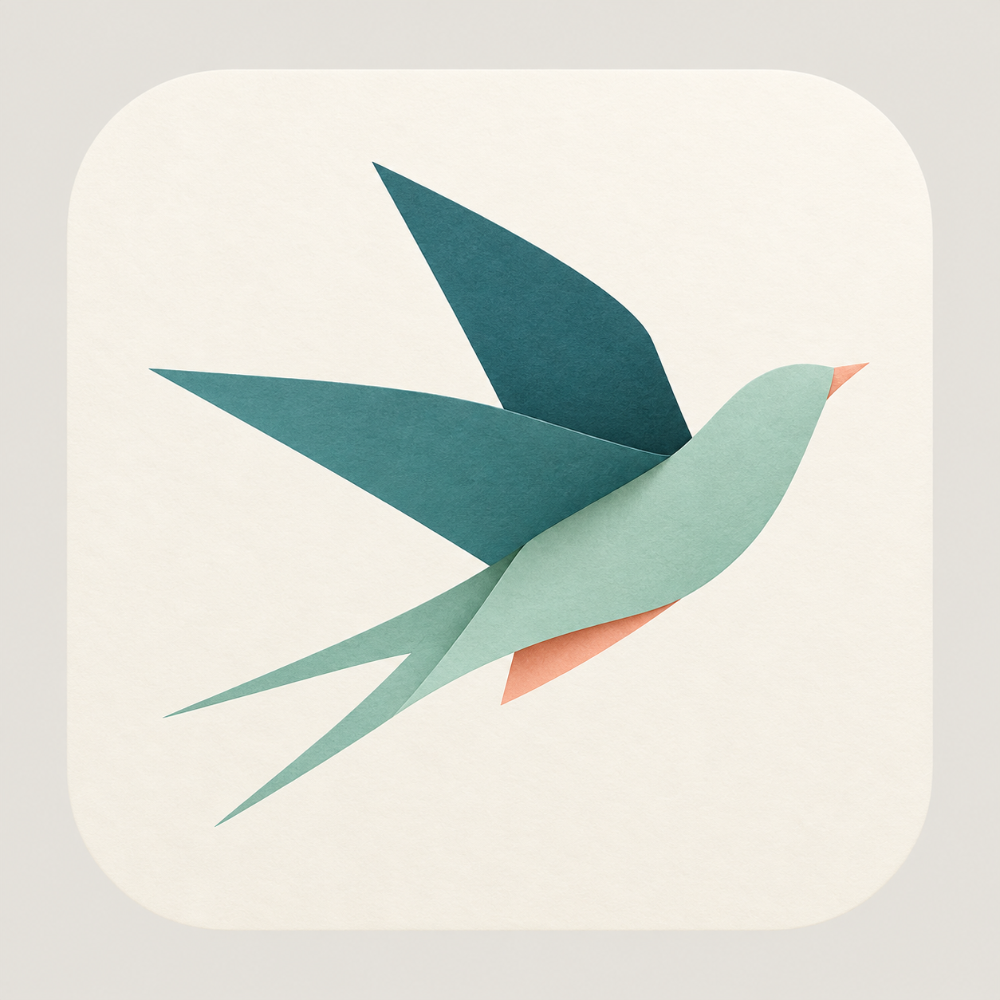
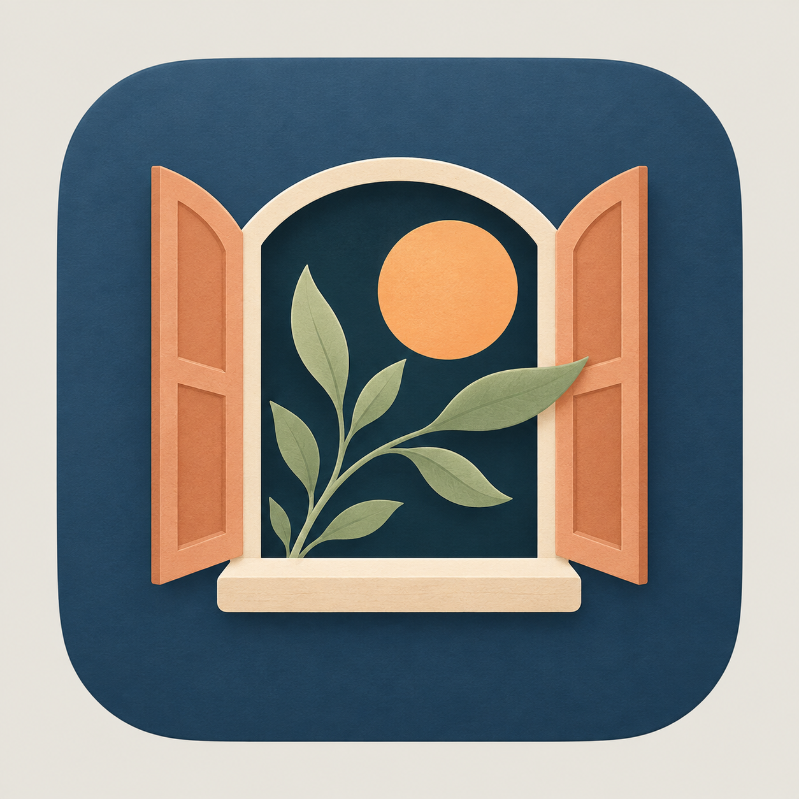
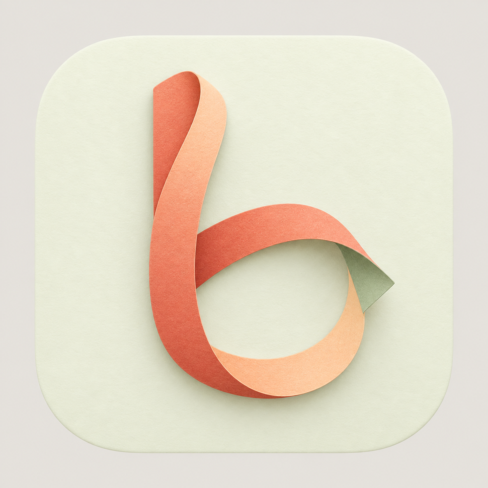
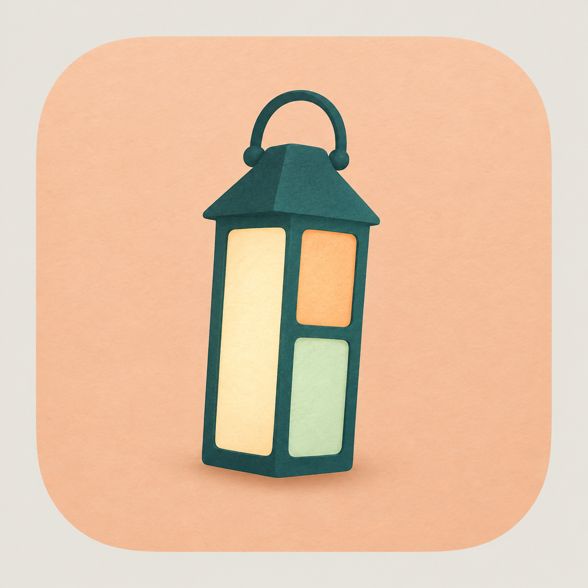

# Warm bmux icon concepts

Five alternatives generated with the built-in image generation tool. The brief was to make the hacker browser's icon feel more humane, pleasant, interesting and unique while avoiding the bulk of the first selected icon.

These concepts explore paper, plants, nature and everyday objects, with warmer colors and softer shapes. They are review previews on opaque backgrounds. **Little lantern is selected for the app.** Its [production artwork](../../app-icon.png) uses a transparent outer margin.

## 1. Paper swallow

Prompt:

Use case: logo-brand. Asset type: a single original macOS app icon for bmux, an independent keyboard-driven browser. Art direction: humane, pleasant, quietly playful, interesting and distinctive. The user found previous inflated icons too fat and thin technical symbols too cold. Create a thoughtful illustrated symbol with warmth and a little personality, a graceful memorable silhouette, airy proportions and confident simple shapes. It should feel like a well-loved independent creative tool for adults. Beautifully composed, restrained tactile paper surface with very subtle depth between flat layers, crisp smooth edges, readable at dock sizes, no tiny details. No generic corporate tech logo, science atom, Saturn orbit, hacker imagery, code, neon glow, glossy plastic, inflated puffy 3D, emoji face, text, lettering, numbers, watermarks, product mockup or surrounding objects. Square 1024x1024 image. One softly rounded square app tile occupies 80 percent of the canvas, centered, with a uniform opaque warm light gray #e9e6df outside it; do not use transparent background or checkerboard. The main mark fits comfortably inside the tile with ample breathing space. Concept PAPER SWALLOW. An elegant little swallow gliding up and right, composed of just three beautifully folded paper shapes. A slim mint body and two long angular teal wings subtly suggest overlapping browser tabs; one small peach fold peeks from the underside like a warm surprise. Asymmetric upward motion, long forked tail, a simple very small pointed beak. No eyes or facial features, no outlines. The bird is streamlined and nimble, not round or chubby. Cool mint, muted deep teal, tiny soft coral accent on a warm ivory tile. Restrained Japanese paper-cut editorial sensibility, original silhouette, gentle fold shadows that do not add bulk. The swallow fills about 56 percent of the canvas width.

## 2. Window garden

Prompt:

Use case: logo-brand. Asset type: a single original macOS app icon for bmux, an independent keyboard-driven browser. Art direction: humane, pleasant, quietly playful, interesting and distinctive. The user found previous inflated icons too fat and thin technical symbols too cold. Create a thoughtful illustrated symbol with warmth and a little personality, a graceful memorable silhouette, airy proportions and confident simple shapes. It should feel like a well-loved independent creative tool for adults. Beautifully composed, restrained tactile paper surface with very subtle depth between flat layers, crisp smooth edges, readable at dock sizes, no tiny details. No generic corporate tech logo, science atom, Saturn orbit, hacker imagery, code, neon glow, glossy plastic, inflated puffy 3D, emoji face, text, lettering, numbers, watermarks, product mockup or surrounding objects. Square 1024x1024 image. One softly rounded square app tile occupies 80 percent of the canvas, centered, with a uniform opaque warm light gray #e9e6df outside it; do not use transparent background or checkerboard. The main mark fits comfortably inside the tile with ample breathing space. Concept WINDOW GARDEN. A small open terracotta window viewed straight on, with two narrow shutters swung outward and an airy central opening. A single graceful sage-green sprig grows from the lower sill and curves gently across the opening, and one warm apricot sun sits behind the window. Use a few simple clean shapes, softly asymmetric handcrafted proportions and thin elegant shutters. This is a symbolic miniature of an inviting place to explore, not a detailed building or landscape. Central dark petrol opening offers contrast, warm peach shutters, sage plant, cream highlights, on a muted deep dusk-blue tile. No bricks, curtains, flowerpot, roof, clouds or scenery. The icon should be quietly friendly and beautifully minimal, like a tiny piece of flat painted wood.

## 3. Quiet moth

Prompt:

Use case: logo-brand. Asset type: a single original macOS app icon for bmux, an independent keyboard-driven browser. Art direction: humane, pleasant, quietly playful, interesting and distinctive. The user found previous inflated icons too fat and thin technical symbols too cold. Create a thoughtful illustrated symbol with warmth and a little personality, a graceful memorable silhouette, airy proportions and confident simple shapes. It should feel like a well-loved independent creative tool for adults. Beautifully composed, restrained tactile paper surface with very subtle depth between flat layers, crisp smooth edges, readable at dock sizes, no tiny details. No generic corporate tech logo, science atom, Saturn orbit, hacker imagery, code, neon glow, glossy plastic, inflated puffy 3D, emoji face, text, lettering, numbers, watermarks, product mockup or surrounding objects. Square 1024x1024 image. One softly rounded square app tile occupies 80 percent of the canvas, centered, with a uniform opaque warm light gray #e9e6df outside it; do not use transparent background or checkerboard. The main mark fits comfortably inside the tile with ample breathing space. Concept QUIET MOTH. A poised, graceful little moth viewed from above, formed from four tapered leaf-like wings around one very slender dark body. Long swept upper wings and small lower wings make an airy diamond silhouette, with a tiny warm amber diamond on each upper wing. Sage and soft seafoam wings with subtle warm cream paper layers. Two fine curved antennae add curiosity, no face, no cute eyes, no fuzz, no legs, no anatomical detail. Sophisticated contemporary nature illustration reduced to a unique compact app mark; warm, curious, lightly mischievous without being childish. Deep aubergine-charcoal tile with a tiny warm peach tail tip. Keep wings thin and pointed, no fat rounded butterfly lobes, no outlines, no neon.

## 4. Ribbon trail

Prompt:

Use case: logo-brand. Asset type: a single original macOS app icon for bmux, an independent keyboard-driven browser. Art direction: humane, pleasant, quietly playful, interesting and distinctive. The user found previous inflated icons too fat and thin technical symbols too cold. Create a thoughtful illustrated symbol with warmth and a little personality, a graceful memorable silhouette, airy proportions and confident simple shapes. It should feel like a well-loved independent creative tool for adults. Beautifully composed, restrained tactile paper surface with very subtle depth between flat layers, crisp smooth edges, readable at dock sizes, no tiny details. No generic corporate tech logo, science atom, Saturn orbit, hacker imagery, code, neon glow, glossy plastic, inflated puffy 3D, emoji face, text, lettering, numbers, watermarks, product mockup or surrounding objects. Square 1024x1024 image. One softly rounded square app tile occupies 80 percent of the canvas, centered, with a uniform opaque warm light gray #e9e6df outside it; do not use transparent background or checkerboard. The main mark fits comfortably inside the tile with ample breathing space. Concept RIBBON TRAIL. One slim paper ribbon bends into an airy, friendly abstract lowercase-b-shaped path, rising vertically on the left, looping loosely down and around to the right, with one small free end flipped outward like a page being turned. A graceful off-center silhouette with a broad hollow middle, paper strip only about one ninth the width of the mark, never tubular or inflated. Muted coral ribbon on one face, warm peach reverse, and a single tiny sage fold at the tip. Soft layered paper shading, relaxed crafted curves with one crisp intentional fold. Very light pistachio-cream app tile. No typography, letters added as text, terminal prompt, orbit, eye, face or decorative dots. A playful but mature object, distinctive even as a small silhouette.

## 5. Little lantern

Prompt:

Use case: logo-brand. Asset type: a single original macOS app icon for bmux, an independent keyboard-driven browser. Art direction: humane, pleasant, quietly playful, interesting and distinctive. The user found previous inflated icons too fat and thin technical symbols too cold. Create a thoughtful illustrated symbol with warmth and a little personality, a graceful memorable silhouette, airy proportions and confident simple shapes. It should feel like a well-loved independent creative tool for adults. Beautifully composed, restrained tactile paper surface with very subtle depth between flat layers, crisp smooth edges, readable at dock sizes, no tiny details. No generic corporate tech logo, science atom, Saturn orbit, hacker imagery, code, neon glow, glossy plastic, inflated puffy 3D, emoji face, text, lettering, numbers, watermarks, product mockup or surrounding objects. Square 1024x1024 image. One softly rounded square app tile occupies 80 percent of the canvas, centered, with a uniform opaque warm light gray #e9e6df outside it; do not use transparent background or checkerboard. The main mark fits comfortably inside the tile with ample breathing space. Concept LITTLE LANTERN. An inviting, slender little lantern seen straight on with a softly angular deep-teal frame, a small elegant arched handle, and three luminous panes: one tall warm-cream left pane, two smaller stacked apricot and pale mint panes on the right. A browser workspace reimagined as a small welcoming light. Very slight jaunty tilt to the whole lantern, charming handcrafted asymmetry, narrow frame and straight crisp pane edges with softly rounded corners. No literal flame, bulb, light rays, face or surrounding scene. Restrained warm paper translucency and one delicate layer shadow, no bloom and no glossy glass. Muted warm peach app tile. Main lantern is tall and slim, about 29 percent canvas wide and 54 percent high; no thick base, no bulky camping equipment. Pleasant independent software character.
